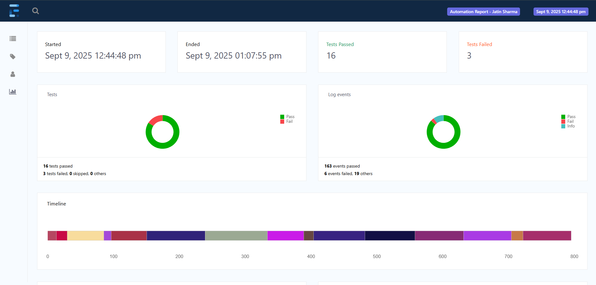
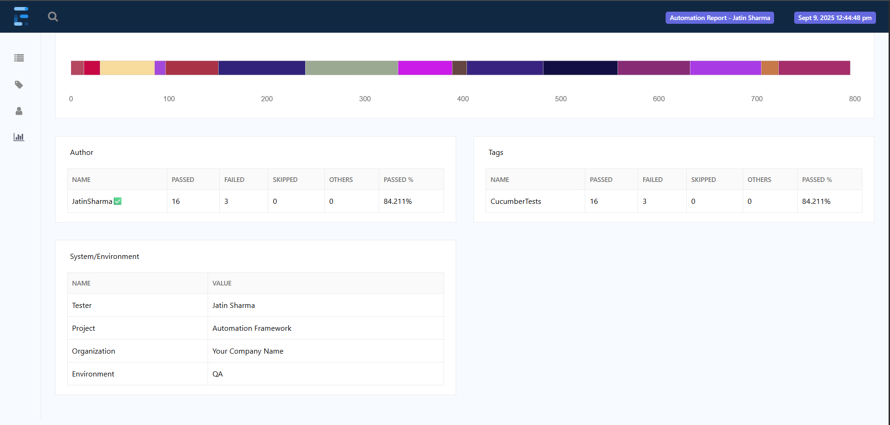
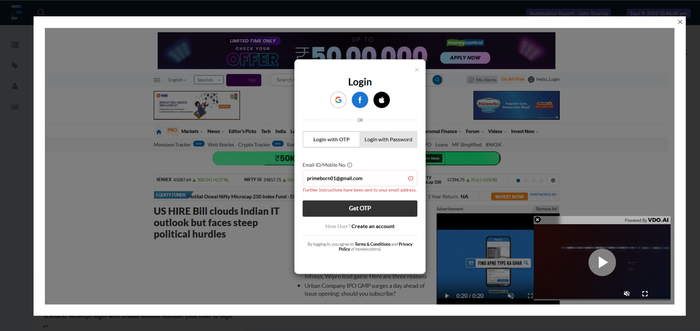
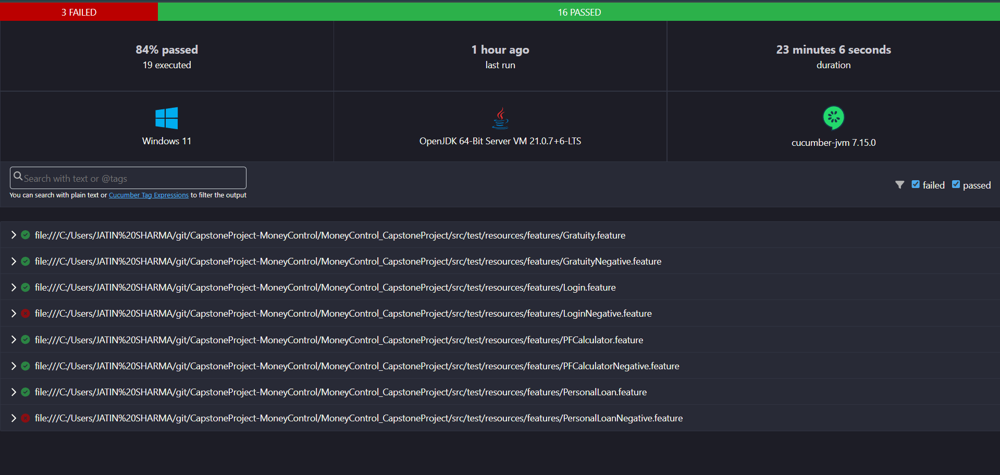

# 🚀 EXRTUT - MoneyControl Selenium Automation Project

## 📌 Project Overview
**EXRTUT** is a **Selenium-based web automation project** developed for the **MoneyControl Capstone Project**.  
It automates financial calculators such as **Provident Fund**, **Gratuity**, and **Personal Loan EMI** to help users validate and test financial computations efficiently, saving manual effort and ensuring accuracy.

---

## ✨ Features
- 💻 Automated **Provident Fund Calculator** tests  
- 🏆 Automated **Gratuity Calculator** tests  
- 🏦 Automated **Personal Loan EMI Calculator** tests  
- ✅ Handles edge cases and input validations automatically  
- 📊 Generates **detailed test reports** using **ExtentReports**  
- 🐞 Captures screenshots on test failures for debugging  

---

## 🌟 Impact
- Reduces **manual testing effort** by automating repetitive tasks  
- Ensures **accuracy and reliability** of financial calculations  
- Provides **quick feedback** for developers through automated test reports  
- Improves **test coverage** and efficiency for MoneyControl calculators  

---

## 🛠 Tech Stack
- **Java JDK 21**  
- **Selenium WebDriver** for browser automation  
- **TestNG** for test management  
- **Cucumber BDD** for feature-driven testing  
- **ExtentReports** for detailed reporting  
- **Log4j2** for logging  
- **Maven** for dependency management  
- **ChromeDriver & Chrome Browser**  

---

## ▶️ How to Run the Project

1. Clone the repository: "https://github.com/Jatin-6622/MoneyControlAutomation.git"
2. Import in Eclipse:
- File → Import → Existing Maven Project → Select project folder
3. Update Maven dependencies:
- Right-click project → Maven → Update Project (Alt+F5)
4. Run Tests:
- Using Test Runner: Right-click `TestRunner_CNG.java` → Run As → TestNG Test  
- Using Feature File: Right-click a feature file → Run As → Cucumber Feature
5. Check Extent Report:
- Open report at: `reports/ExtentReport.html`  

---

## 📝 Notes
- Tests are organized under `@positive` and `@negative` tags.  
- 📸 Screenshots for failed steps are captured automatically in **Extent Reports**.  
- 🗂 Logs are generated using **Log4j2** in `logs/automation.log`.  

---

## 📁 Folder Structure

---

## 📊 Test Reports
- ExtentReport.html contains a detailed test execution report with screenshots.  
- JSON and HTML reports are generated in `target/` folder.  

**✍️ Author**
Jatin Sharma

---

🔗 Badges
    

